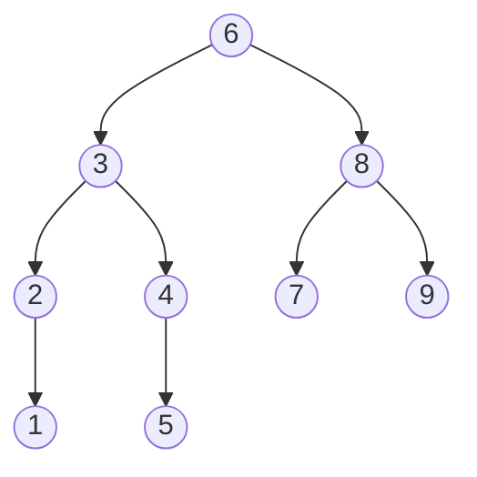
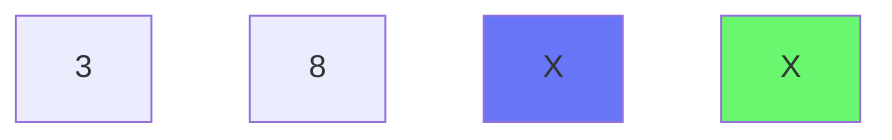

**ФИО:**__________________________________________

**Факультет, групппа, курс:**__________________________________________

# Код
**1\.** В чём разница передачи параметра по ссылке и по значению?

**Ответ:** _____________________________________________________________________________________________________________________________________________________________________________________________________________________________________________________________________________________________________________________________________________________________________________________________________________________________________________________________________________________________________________________________________________________________________________________________________________________________________________________________________________________________________________________________________________________________________________________________________________________________________________________________________________________________________________________________________________________________________________________________________________________________________________________________________________________________

**2\.** В каком порядке будут посещены вершины дерева при обходе в ширину и при обходе в глубину?

**В ширину:**

**В глубину:**

<p style="page-break-before: always">

**3\.** Дана программа на C++. Напишите какой будет вывод данной программы. 
```cpp
#include <iostream>
#include <thread>

void incThread(int* number) {
    for (int i = 0; i < 50000000; i++) {
        *number += 1;
    }
}

void decThread(int* number) {
    for (int i = 0; i < 50000000; i++) {
        *number -= 1;
    }
}

int main()
{
    int a = 0;
    std::thread inc = std::thread(incThread, &a);
    std::thread dec= std::thread(decThread, &a);

    // Дожидаемся конца выполнения обоих потоков
    if (inc.joinable() || dec.joinable()) {
        inc.join();
        dec.join();
    }

    std::cout << a << '\n';
    return 0;
}
```

**Ответ:** ________________________________________

<p style="page-break-before: always">

**4\.** Реализовать любой алгоритм сортировки. Исходный массив состоит из целых чисел. Язык программирования - любой. 
*Примечание*: желательно реализовать эффективный по времени выполнения алгоритм, а так же не создавать новый массив, а изменять входной.

<p style="page-break-before: always">

# Железо
**1\.** Посчитать напряжение по закону Ома

**2\.** Предложить программно-аппаратное решение проблемы дребезга контактов

**3\.** 

# Всякое

**1\.** Перед нами 4 карты. 2 из них - рубашками вниз, 2 - рубашками вверх. Дано утверждение: "Карты с чётным числом - синие". Какое минимальное количество карточек необходимо перевернуть, чтобы проверить данное утверждение?


